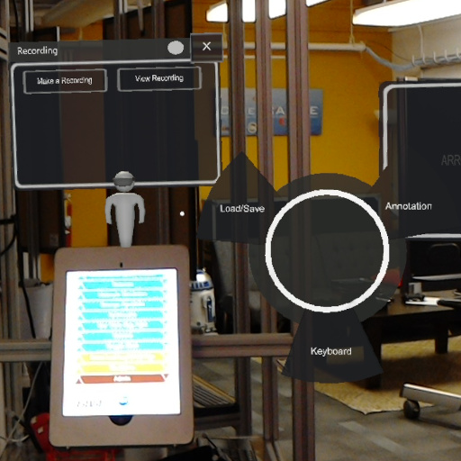
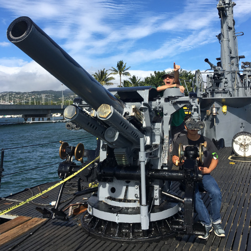

  
  

## Introduction

HoloSage was a project that I started while working in the Laboratory for Advanced Visualizations and Applications (LAVA).  This project was actually contracted by one of the navy departments, because they wanted to see if they could use Augmented Reality (AR) to teach new users how to operate and maintain large vehicles such as submarines.  The original idea was that they wanted to use the Microsoft Hololens, and have a senior engineer walk around a room and create different notes in different locations.  For example they could leave text notes by certain dials that specified what each dial did and why they were important.  They could also get different colored pens and draw notes into the 3D space to mark things like designated paths and dangerous areas.

## Starting the Project

When I first started working on HoloSage, I had absolutely no idea how to do AR development.  I did have prior experience in developing for Unity as well as some VR development, but AR was a completely new field for me.  In addition to this, AR is still a relatively new field at least when developing for the Hololens.  There wasn't a lot of good descriptive documentation online, which made learning it even more difficult.  It took me a really long time before I even had something resembling the project.  I remembered the first feature I implemented was the ability to draw using the AirTap gesture on the hololens.  You could get your hand, pinch and move it around, and a line would draw where you were looking.  I was really happy to get this working because up until this point I was having next to no results and no way to see if what I was doing was working.  After this I then added in saving and loading the points of the line to the Hololens, so now there was a way to persistently store the lines you drew.

## Restructuring

Around this time I was getting pretty comfortable with writing for AR, and looking at the code I had written I realized that I had hacked a lot of this project together.  Since I knew that we were going to have to take this project a lot farther, I decided to rewrite the majority of the code.  When I rewrote the code, I decided to use a selection of different design patterns, the main one being called "strategy".  I created an interface called ISaveable which was implemented by each of the note objects (lines, pointers, text), and each one was forced to implement two methods called Save() and Load().  From then on whenever I had to add new items I would simply have them implement these two methods and that way I could save and load every type of object the same way.  I also rewrote the rest of the project using and Abstract factory to create all of the objects and Subscriber/Publisher to handle all of the Hololens inputs.  I also decided that now would be a good time to comment all of the code that I had written.

## A New Member

As the semester ended, I had a new member named Justin jump onto the project. Fortunately for me I had just rewritten and commented all of the code making it a lot easier to understand.  Because of this it was very easy for Justin, who already had experience developing in Unity, to integrate into the project.  Justin was a fast learner so there really wasn't a lot to teach him.  After this we started on newere features for the hololens.

## New Developments

Since then we have worked on a lot of new feature for HoloSage.  We have changed the workflow of the program to use a recording and playback feature to record notes.  Essentially, the user hits record, then both talks while marking up the room.  When another user hits play, they can listen to the audio while seeing the notes being redrawn in real time.  We thought this allowed for a more interactive program for the user.  We also had the opportunity to test HoloSage inside of one of the USS Bowfin in Pearl Harbor.  Justin has been working on a ton of new feature including video recording, UI/UX improvements, and pausing while recording.

## Conclusion

Working on HoloSage has been a great opportunity to work on a larger-scale, official project.  I also learned a lot about developing for AR and all of the problem that were associated with it.  I learned about working with multiple people on a project as well as leading other programmers in development.  I really enjoyed working on this project and I hope I can use this experience in other fields as well.
