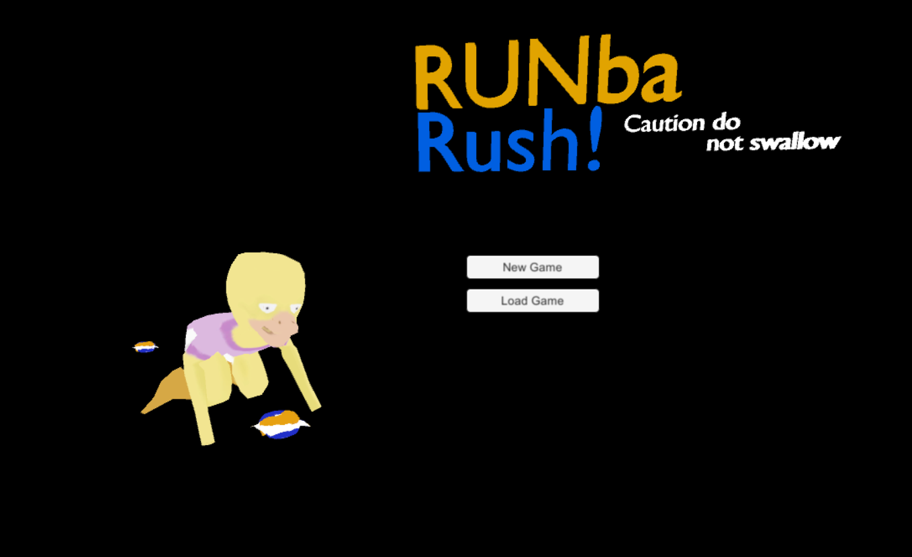
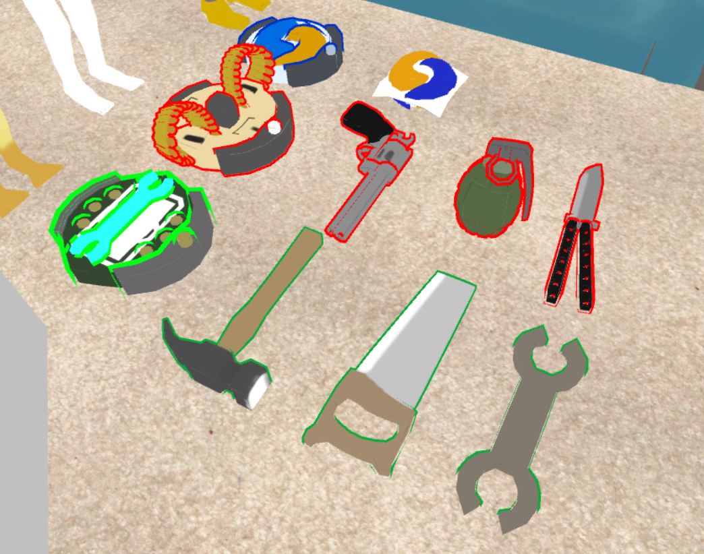

  

    
  

  

    
  

## Introduction

Runba Rush was a game that I helped create for the 2018 Honolulu Global Game Jam.  The theme for the game was Transmission, and we interpreted that as being transmission control from a controller to a robot.  The original idea was to have roomba vacuum cleaners on the floor picking up garbage.  Then we decided that we could make the game even more complex.  We decided that you would have multiple different vacuum cleaners, and each cleaner would be able to pick up one time of item.  In addition to this, you would have to control every single vacuum cleaner at the same time.  The twist was that each cleaner reacted to your input differently.  For example one of the roombas would completely map to the arrow keys (Up would make it go upward, Down would make it go downward).  One of the roombas would have inverted controls (Up would make it go downward, Up would make it go downward). The third roomba had rotating controls (Up/Down would make it go forward and back, while Left/Right would make it rotate).  The struggle would be to pick up all of the items using all 3 roombas simultaneously before a baby could eat the items.

## Creating the Game

Since this was for a Game Jam, we only had 2 days to make this game.  We decided that the best way to split up the work was for me to do all of the 3D Models, and have Justin do all of the coding.  Since the concept of the game involved picking up items on the floor before a baby could get them, I decided to make the items ridiculously dangerous.  I made hammers, saws, knives, and guns in order to make the game have a overexaggerated feel.  After creating all of the props, roombas, and characters, I helped Justin incorporate it into the game.  To make things even more ridiculous I created a terribly animated cutscene in the beginning (it was my first time trying to make a cutscene) and think despite how bad it was, it gave our game the crazy feeling that I wanted.

## Conclusion

For the Game Jam there were 3 categories, Best Overall, Most Creative, and Most Diverse.  Our game took Most Diverse because of its absolute craziness and our use of the additional themes that we were given.  Last Game Jam I had tagged along with a group and only contributed minimally.  This year it was nice to have my own team and be one of the major contributors to the game.
