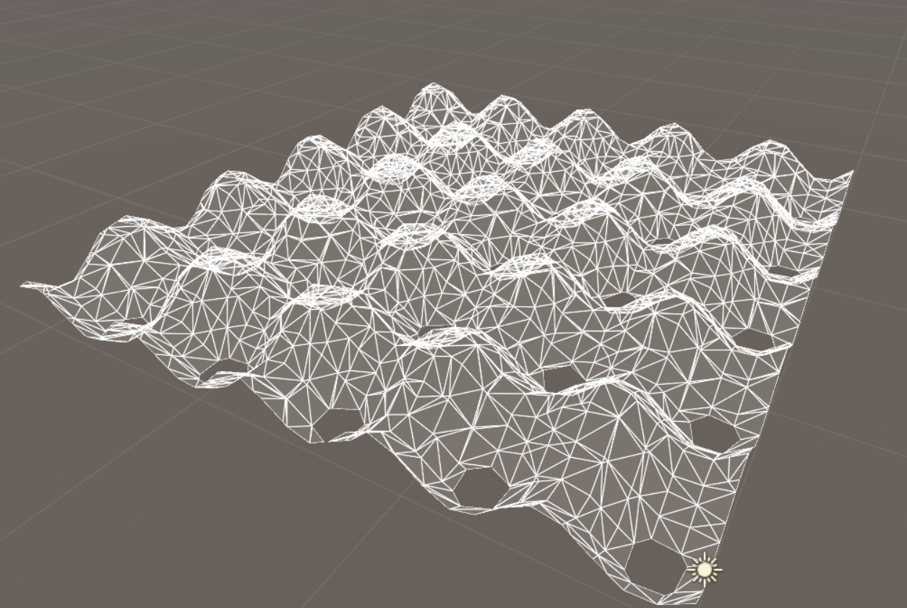

## Introduction

Winds of Sarkha is a dream-list game that I've always want to make.  I wanted to have a game that combined the exploration of procedurally rendered terrain, with all of the adventure of an RPG.  All of this tied together with a character controller that could properly explore and battle.  This is definitely not a game that I am finished with, I've actually barely started.  I have started on a very basic idea for the game.  I have drawn some concept art, and also started learning how to write Compute Shaders in order to learn how to render and calculate the procedural terrain in the GPU.  

## The Art

I just want to put out there that I am by far not the best artist in the world.  However, I need to put things down on paper so I can see what they look like in my head.  With that said I have a pretty basic idea of what I want this game to look like. Nice mountains and scenery would be great.  I just need to work on the next part.

## Compute Shaders

Prior to starting this, I have had no prior experience in writing anything GPU related.  I thought that a good way to go about learning would be to read some books on it so I started reading the Nvidia book on CG as well as some of their GPU Gems.  From the GPU Gems I found out about the marching cubes algorithm, which is an algorithm used to create voxel terrain.  I did my best to implement this code, starting by doing it in the CPU, and when I finally got that working, in the GPU.  Eventually I had a couple compute shaders that could make very simple voxel terrain.  So far that's as much as I've gotten.

## Conclusion

It's going to be a while before this game is anything even remotely recognizable.  I really hope this can be something cool one day, it's something that I've always wanted to make.
