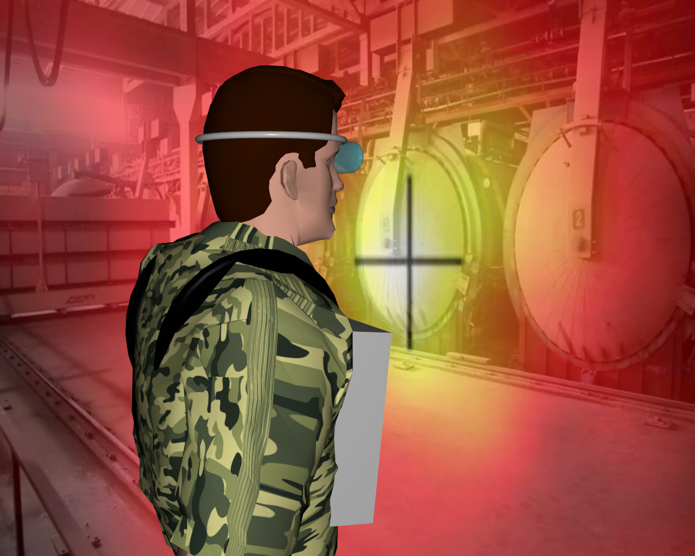
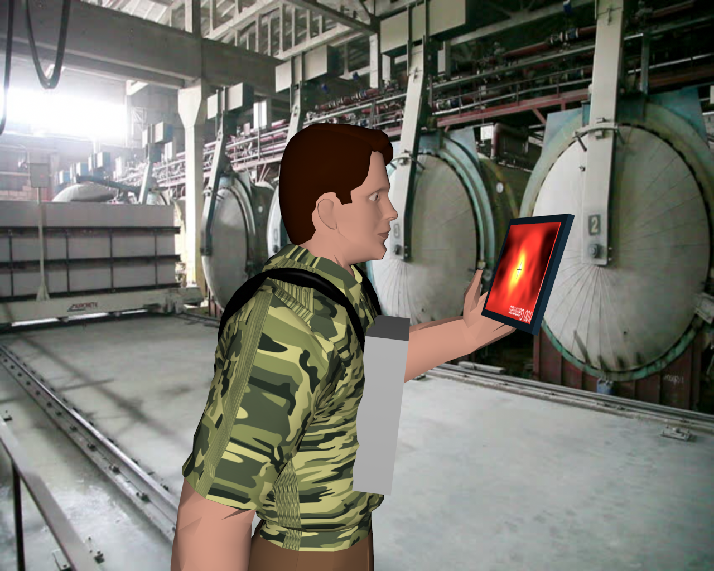
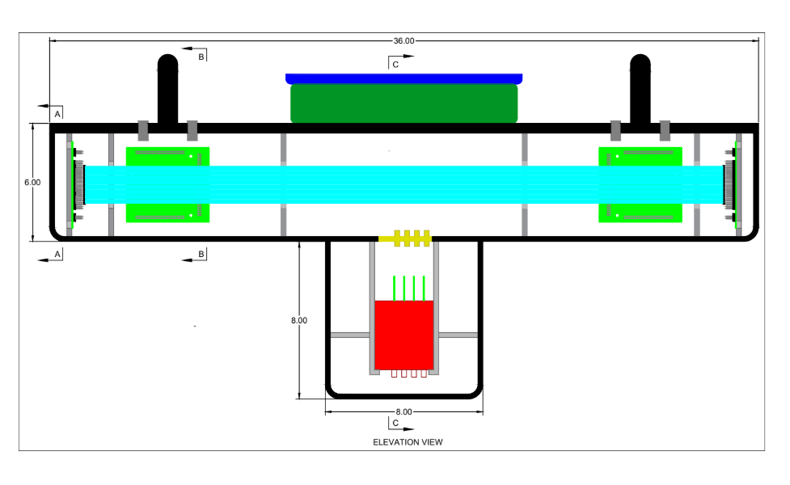
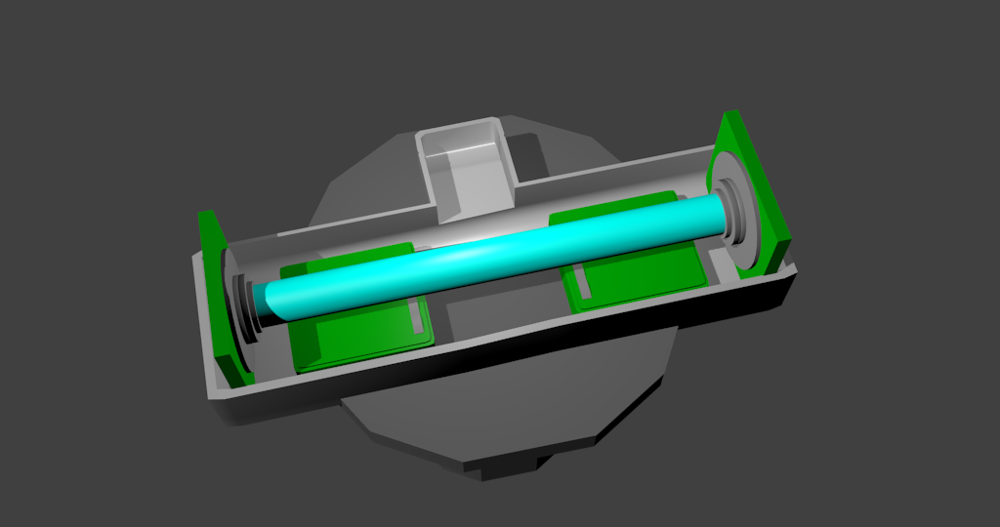
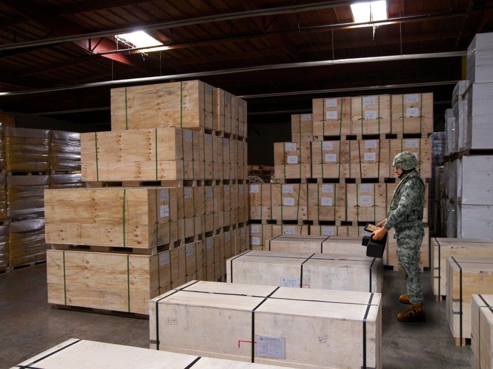
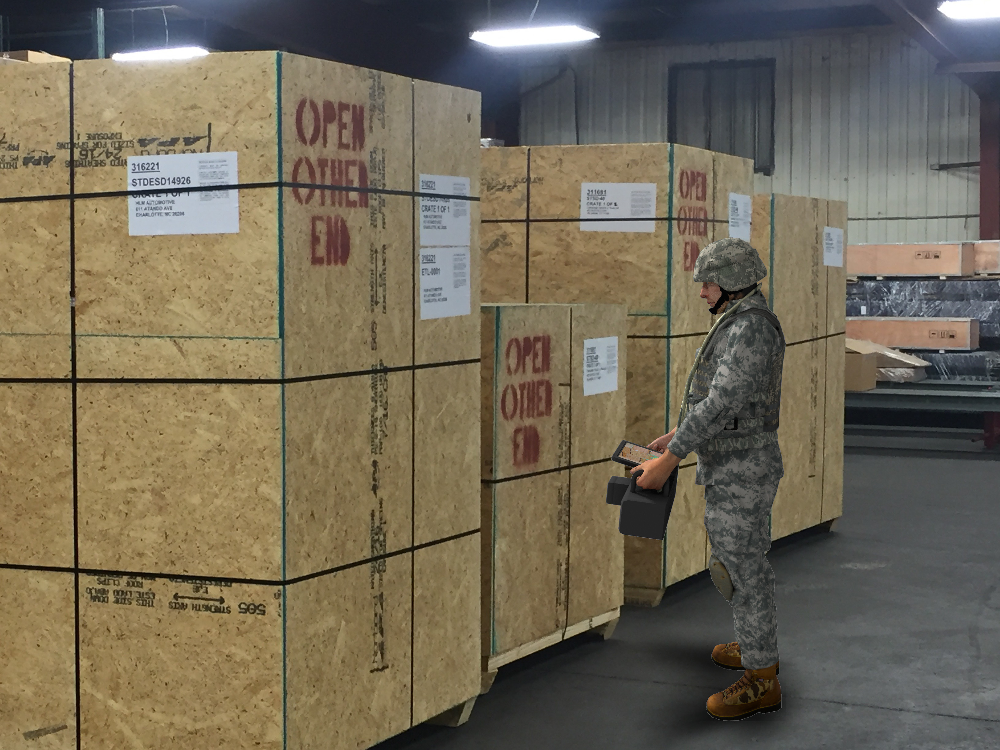
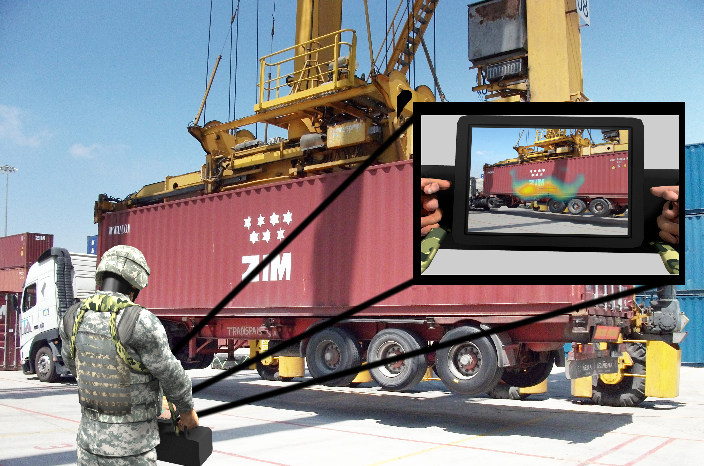

## Introduction

Before I started working in the Laboratory for Advanced Visualizations and Applications (LAVA), I used to go there and hang out.  This is how I got my job working there.  Some grad students from the Physics department came to our lab because they had an idea for an invention and needed a mock-up.  Their idea was to have a long rod that detects any sources of radiation, then have it project onto a screen so you can see where that radiation is being generated in the area around you.

## My Job

Since they needed to get funding, they needed a way to show the concept to possible sponsors.  What they wanted me to do was create a 3D model mockup of the device, render it from different angles, then create different images showing it's possible uses. 

First they gave me some concepts on how they wanted it to look like and function:

  

    
  

  

    
  

<h5>These are what they originally gave me when they told me what they wanted, The two on the left are two simple mockups they made, and the right is a blueprint of the device</h5>

 
Then I bought some 2 dollar 3D model of a soldier from online.  I then rigged him up so that I could put him in different poses.  Using Blender I made a mockup of the device and then attached it to the model.  
 

  

    
  

  

    
  

<h5>Both the model I made, with the renders I created.  Let it be known that I didn't make the soldier, we bought it because it was pretty cheap.  I did rig it however for the different poses.</h5>

From there I created renders of different angles of the model and device.  Finally I made different images where you can see the device being used.

  

    
  

  

    
  

<h5>Using editing tools I simply put the render into some possible situations this device could be used.  One example was inspecting shipping containers, another was to check radioactive zones</h5>

## Conclusion

Overall I thought this was a really good experience since I had never had to do mockups before.  It was also cool to see some of the applications of 3D modeling since I had never had to use it for anything other than game design.
