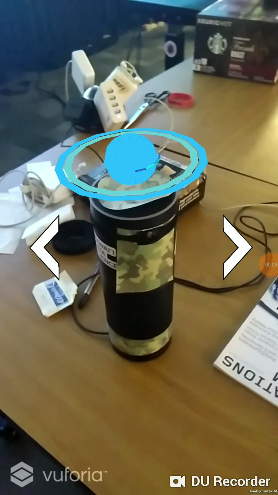
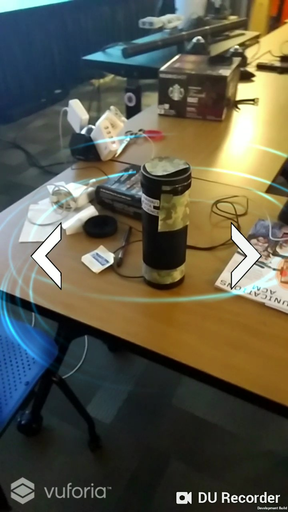
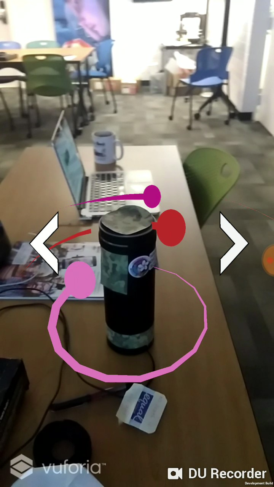
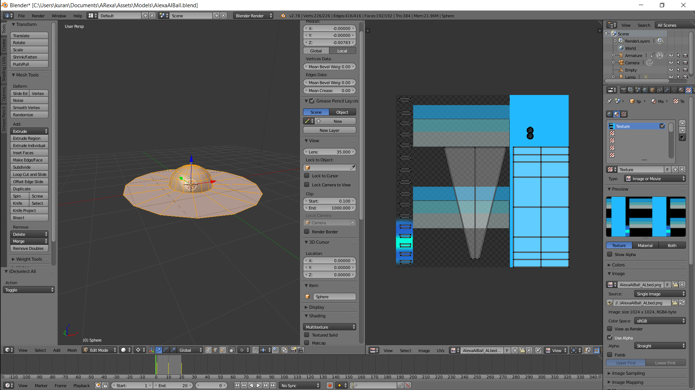

<iframe width="100%" height="400" src="https://www.youtube.com/embed/XGOBhri4-U0" frameborder="0" allow="autoplay; encrypted-media" allowfullscreen></iframe>

## Introduction

This was a project that I created with my friend to learn how to do Mobile AR Development.  I have developed for mobile before but since I typically always developed for the hololens, I never really got a chance to do AR for mobile.  I wanted to do something I could to in maybe a day or two so I thought it would be fun to make an AR app for the lab Amazon Alexa.

## Setting Everything Up

By setting up I mean matching jdk and sdk versions for java and android.  Honestly I think that this was the hardest part because we had to revert back on a couple versions despite everything else online telling us that the latest versions worked flawlessly.

## Learning Vuforia

I know that there's a lot of different software for AR Image Tracking and Object Tracking but I had seen Vuforia before and it seemed like the most popular option. I also noticed that a lot of other options were marketed as "Vuforia Alternatives", so I figured that I may as well just use the original.

Using Vuforia was pretty easy since it was directly integrated into Unity.  We just made an account and downloaded the 3D scan app for Vuforia so we could start scanning in things.  We scanned in a bunch of stuff in the lab, like coffee cans, until we got the hang of using the app.  After that we 3D scanned in our Amazon Alexa.  

## Creating Some Aesthetic Effects

After we got all the Vuforia components working correctly I went into Blender to go make some effects and animations for Unity.  We brainstormed a couple ideas to have for Alexa which were an interactive blue ball, and active nexus effect, and some orbiting planets. 

  

    
  

  

    
  

  

    
  

<h6 style = "text-align:justify">
    The 3 effects we created for AR decorations
</h6>

Most of the effects could be made directly in Unity but the interactive ball needed a little bit of Blender work.  Basically all I did in Blender was model the ball, set up it's UVs for UV animations, then create some short animations to make it look clean.

  

<h6 style = "text-align:justify">
    I made the floating ball in Blender and set it up so that if you scroll the UV texture upward on the UV it generates that pulsing effect we wanted.
</h6>

## Putting Everything Together

  

<h6 style = "text-align:justify">
    I made an animation controller to handle how the ball moved, it only has two states so it's not particularly complex or anything.  The movements were pretty simple and I probably could have just programmed the transform but Unity has a lot of built in animation support so I figured it would be easier to do it this way.
</h6>

Once I made all of the components I imported everything into Unity.  I wrote a couple scripts to control the effects.  The main things I wrote were the script to control the UV animations, and floating animations for the ball, the script to rotate the planets at different speeds, and the script to control the particle system for the nexus effect.  

  

<h6 style = "text-align:justify">
    We made sure to make a transparent mask for Alexa so that when it was rendered into the environment, she would hide things that went behind her.
</h6>

## End Product

At the end we had an AR app that would recognize our Alexa, and swap between different effects.  You could also just add new GameObjects and in Unity and it would add those to the swapped effects.  If I did continue this I would have to look into the Alexa Voice Services Documentation since that's the only way to figure out when she is actively listening, and I wanted the decorations to change with her state. I think Amazon keeps it somewhat locked down and if I did do this, I would need to get a Raspberry Pi to emulate Alexa and write an app directly for Alexa.  Overall I thought this was a good learning experience and I hope I get the chance to do more mobile AR development.  
